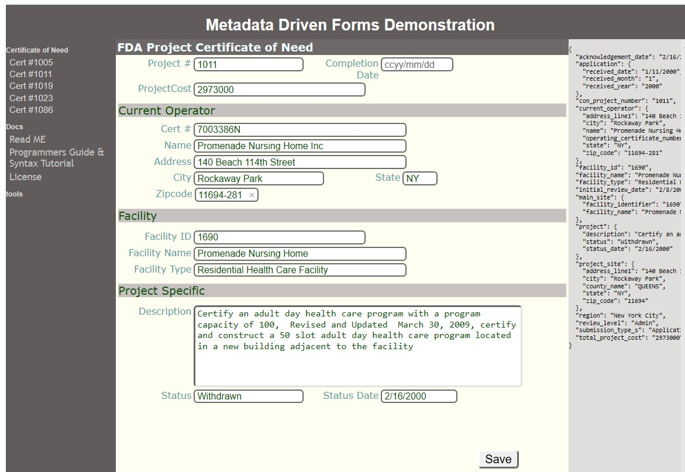
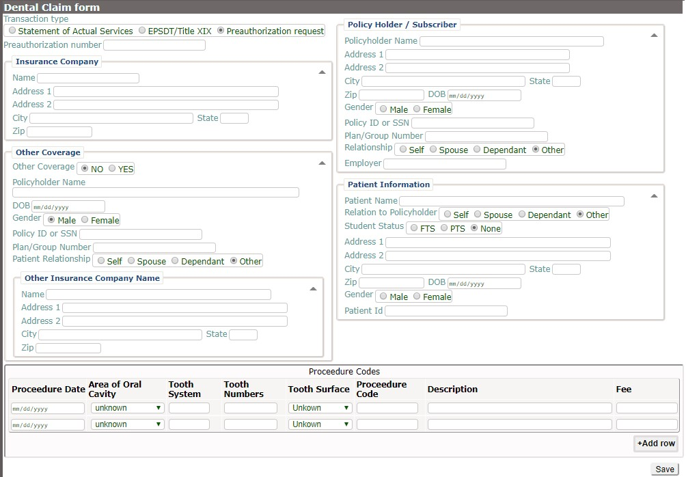
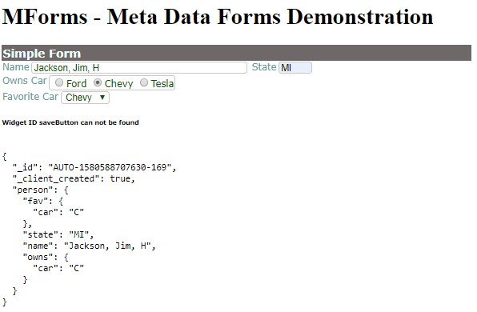

# 
# Meta data driven forms GUI for REST services
###### ***Status: Alpha-Dev** - Ready to use in projects but some features may need enhancements.*   

Building forms based GUI to CRUD operations.  Provide a Meta data based system to deliver highly Git Demo functional user interfaces for editing, viewing and updating data in REST based services.   Can dramatically reduce the Labor required to build and maintain custom GUI while retaining sufficient flexibility to deliver a pleasant and efficient user experience.  

* **[simple demo]( https://joeatbayes.github.io/metadata-forms-gui/)** on github pages.  Gitpages only allow form display and will not accept updates.   If you wish to demonstrate saving data via REST calls then a server capable of processing PUT and POST commands must be available.  See: [httpServer](httpServer)

Please file a Issue to request enhancements.  You can also reach me on Linked-in [Contact](https://www.linkedin.com/in/joe-ellsworth-68222/)   main Git Repo URI:   [metadata-forms-gui](https://github.com/joeatbayes/metadata-forms-gui) 

# Sample Screen

> ### Certificate of Need

[Live Version]( https://joeatbayes.github.io/metadata-forms-gui/)  [metadata source](data/forms/cert-of-need/cneed.txt)  [html source](http-docs/index.html)

> ### Dental Claim Form

[Live Version](https://joeatbayes.github.io/metadata-forms-gui/dental-claim.html)   [metadata source](data/forms/dental/claim/dental-claim.txt)    [html source](http-docs/dental-claim.html)

> ### Simple Form

[Live Version](https://joeatbayes.github.io/metadata-forms-gui/simple-form.html)  [metadata source](data/forms/examples/simple-form.txt) [html source](http-docs/simple-form.html)

> ### Simple Form Demonstrating field level Validation

[metadata source](data/forms/examples/field-validator-regex.txt)

## Getting Started

* ### [Programmers Guide](docs/documentation/programmers-guide.md) to get Started creating Forms

* ### [Getting Started Guide](docs/documentation/getting-started.md)

# Files

## Documentation

- [Programmers & Syntax documentation](docs/documentation/programmers-guide.md)
- [Requirements & Future Actions](docs/documentation/actions_roadmap.md)
- [Getting Started Guide](docs/documentation/getting-started.md)

## Directories 

* **[data](data)** - Contains most data used to drive the demonstration forms.  Also contains forms definition
* **data/forms** - Contains all the sample forms definition files 
* **data/forms/cert-of-need** - contains the sample form and widgets needed to display the certificate of need.
* **data/cert-of-need** - Contains sample data for different certificate of need to provide a live editing experience.  This data was download from a US government site.
* **data/widgets** - different pre-defined widgets that can be re-used across forms. 
* **http-server**
* **[docs](docs)** - root directory for the [github pages site] for this repository.  Some forms can be tested directly on this site.  Files are copied into this directory to prepare publishing a new version of the site by [update-gitpages.sh](update-gitpages.sh)
* **docs/documentation** - design notes,  usage documentation,  actions, roadmap, etc that I did not want to keep in the main directory.
* **http-docs**
* **http-docs/js**
* **http-docs/css**
* **http-docs/js**

## Main mForms Implementation

* [mforms.js Main Javascript code](http-docs/js/mforms.js) - Main Javascript implementation That drives the Metadata forms engine.
* [mforms_parse.js](http-docs/js/mforms_parse.js) - Main parser for YAML like syntax used to specify screens
* [browserutil.js](http-docs/js/browser_util.js) - common utilities that make generating high speed RIA applications easy.
* [simple_ajax.js](http-docs/js/simple_ajax.js) - A drop dead simple but fast and highly portable AJAX library.

## HTTP Server

* [httpServer.exe](http-server/http-server.exe) A basic HTTP server to allow local testing of forms and data retrieval logic.   Implemented in  [http-server.go](httpSever/http-server.go)  It maps "/data" to the data directory at [../data](data/) and URI "/" is mapped that is expected to contain the main html and javascript is mapped to [../http-docs](http-docs).   All mapping is relative to current directory where executable is ran so it expects the executable to be ran from inside of "http-docs" All examples are written to expect these to be mapped.  This server can be replaced with an appropriate configured http server provided it supports the correct mapping for /data and /http-docs.  The exe extension is only present in windows.  For MAC and linux it is a executable file of same name without the extension.

## Test Files

* [mforms_parse_test.js](http-docs/js/mforms_parse_test.js) - Tests the YAML like parser with sample test test data in node.js run using node.js locally but is also used by the mforms_parse_test.html to test in browser.
* [mforms_parse_test.html](http-docs/js/mforms_parse_test.html) - May be loaded directly in chrome but most tests are ran in the browser via httpServer.

## Support Files

* [update-gitpages.sh](update-gitpages.sh) - Copies selected code and data to the /docs directory where it can be published to the [gitpages site](https://joeatbayes.github.io/metadata-forms-gui/) for this repository.  This is needed to supply a basically working GUI with working forms without requiring any installation or downloading.    Code ran on the [gitpages site](https://joeatbayes.github.io/metadata-forms-gui/) can not save the updated form data because [github pages](https://help.github.com/en/github/working-with-github-pages/about-github-pages) does not support PUT and POST operations.

