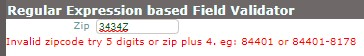

# Metadata Form GUI - Programmer Guide


# Basic Form Usage

* ## Define a Widget

  * ### Hooking widgets to the Data Model

* 

* ## Define a form using the Widget

* Define Groups of Widget

* D

* ## Display the form

* 

* ## Modifying CSS to control form look & Feel

* 

* ## Example JSON Sample Data

* 

* ## Specifying Data Path in the Sample Data

* ## Suppressing the field group with Legend.

* #### Using Containers only for layout rather field grouping.

* 

* ## Specifying  URI to Fetch Data for the form

  * ### Interpolating Data into URI

* ## Redisplaying data from domain objects that have been modified but not saved.

  * By default the system keeps each object in the system with a unique identifier.   If the same object is requested for rendering again then it is rendered from the locally cached object.   This means that it is possible to modify an object switch to editing another and when you switch back the locally modified object will be re-displayed including any edits.  The cached object will remain available in this fashion until the page is refreshed or the browser is restarted.   You can clear an object from cache and force a reload.   
  * One option in the form specification is to clear domain objects after saving to force reload just in case it has changed on the server.   To clear on save  set   clearAfterSave=true in the form level attributes.
  * 

* ## Modifying Content of Dropdown based on prior form selections  

  * Example:  When user selects state then change the set of available zipcodes based on the state selected.  This can be done from subsetting data supplied at the time the form was loaded or by calling a  web service and modifying the affected fields widgets.   Introduces the notion of dependent fields or fields that are affected by actions of other fields.   As a general concept we prefer including the field ID for fields that could affect the operating of the current field. 

  

## Using Custom CSS 

Changing label wrapping behavior

Forcing some fields to render on same line without wrapping

Hide right nav when dispalyed on portrait mode on a phone.

## Injecting forms into Existing Pages


## Parsing Delimited Data


## Rendering Tables 


```

- widget:
  id: procedures
  type: table
  total_col:
    - arrProcFee
   max_visible_rows: 10
   min_rows: 8;
  columns: 
    - arrProcDate
    #- arrProcArea
    #- arrProcToothSystem
    #- arrProcToothNumber
    #- arrProcToothSurface
    #- arrProcCode
    #- arrProcDesc
    - arrProcFee


```


## Define Master Detail Forms


## Using YML Anchors to reduce repetitive Definition


## Changing Label Size for a subset of fields

Useful for example when State follows city on the same line.


### Validating using A RE pattern

The system has the ability to automatically apply regular expressions to validate the contents of a field.   An error message will be displayed as soon the system detects data that violates the required pattern and is removed as soon as the value becomes valid.     This was an explicit design decision because it allows users to fix data early before they are frustrated latter when they try to save.

The valid_pat: tag is used to specify the pattern to match and what message is displayed when the pattern based validation fails. 

Here is a example of the example form when the pattern validation failed.

 

Here is an example of when the same form field has a valid value 

[RE Pattern example src](data/forms/examples/field-validator-regex.txt)

```
-widget:
    id: basic_zip
    data_type: text
    type: text
    label :Zip
    size: 11
    data_context: person.zip
    class: input_field
    valid_pat:
       pattern: ^[0-9]{5}(?:-[0-9]{4})?$
       message : Invalid zipcode try 5 digits or zip plus 4. eg: 84401 or 84401-8178

- form:
   id : sample_field_validator
   class: inputFrm
   label: Regular Expression based Field Validator
   show_data_obj_div: dataObjDiv
   widgets:   
      - basic_zip
      
```

#### Validating with more than one RE pattern

In some instances it is necessary to perform more than one validation.  for example you may want to accept either the USA or French zipcode format.     The system supports this by allowing you to specify more than one pattern as an array.    The system will attempt to match any of he patterns and will consider a match against any single pattern as enough to consider the field value as valid.

[RE  Pattern Example with multiple patterns source](field-validator-regex-multiple.txt)

```
  valid_pat:
       pattern: 
         -^[0-9]{5}(?:-[0-9]{4})?$
         -^(([\d]{2} )|(2[abAB] ))*(([\d]{2})|(2[abAB]))$
       message : Invalid zipcode try 5 digits or zip plus 4. eg: 84401 or 84401-8178
```

​	Any of the patterns being satisfied will allow us to consider the  data in the field as valid.


### Validating using a built-in validation function

.

### Validating using a custom function

### Validating using a Web Service


## Filling in Option list or drop down with Web service Results


# Advanced Formatting


## Supporting Columns

.

## Supporting groups of sections that must reflow together

.

## Designing to support mobile devices

.

## Forcing entire blocks to Reflow

.

## Designing to reflow individual forms


## Support for Subforms using TABS

## Adding Left Nav display of sub forms

## Expanding form sections that contain functions.

## Localizing forms

## Custom Labeling & Branding defined at runtime.

# Diagnostic Tools

## Display the JSON representation of object as it changes

The form attribute  **show_data_obj_div**:  is used to specify that you would like the system to render the JSON representation of the object in a Div that is refreshed every time a field is edited.   Display also occurs when the data if any is loaded from the server.    

This can be useful to ensure the right data elements are hooked to right underlying data models.   The value  specified is used as a DivId to display the JSON into. 

If the attribute is not specified then no rendering occurs.   **show_data_obj_div: dataObjDiv**  in the snippet below will try to render the JSON of the active data object to a HTML Div with the ID of "dataObjDiv" every time the field changes.   [See it in operation](https://joeatbayes.github.io/metadata-forms-gui/) 

```yaml

- form:
   id : basicForm
   class: inputFrm
   label: A Basic Form   
   fetch:
      uri: data/claims/{dataObjId}.JSON
      method: GET
      parse: JSON
   save:
      uri: data/claims/{dataObjId}.JSON
      verb: PUT
      where: body   
   show_data_obj_div: dataObjDiv 
   widgets:   
           - topFieldsGroup
           - saveButton
```


## Testing the YML Parser

.